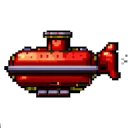

# wolfpack
Learning Ebiten, and generic constrains with pointers, by making a submarine hunt game.  The game consists of a 
destroyer used by the player to sink the passing submarines below; just liek the old Ataru or Commodore games.

## Characters

There are three characters displayed in the game:

### Destroyer


Used by the player to sink the enemy submarines. The destroyer fires deep charges, which have to be reloaded at 
certain intervals.  The left and right arrows are used to move the destroyer, and the space bar is used to fire the
deep charges.

### Uboat


This is the main enemy submarine.  It will show at different speeds and depths and will try to sink the destroyer
shooting torpedoes at it.  There is a slice of uboats (wolfpack), that has to be completely sunk before the boss (U103) 
submarine shows up.


### U103


This is the boss submarine.  Once all of the uboats have been sunk, the boss U103 will show up. The U103 will show up
at different depths, using different speeds.


## Ammo

There are three sets of ammo used by the characters:

### Deep Charges 


### Uboat Torpedoes


### U103 Torpedoes


## Ammo Pool
A pool pattern is being used to manage the character's ammo. Currently, each character can only fire as much ammo as
allowed at one time.  Once the ammo leaves the screen, or explodes by hitting another character, the ammo is returned 
to the pool. These are the current amounts for ach character:

* destroyer has 5 deep charges allocated
* uboat has 3 torpedos allocated
* u103 has 8 torpedos allocated


## Generics
Was playing around with generics. Used them to load the sprites into the corresponding character and ammo images. I used
two separate generic instances for the characters and the ammo. Here is the example for just the characters. **NOTE:** 
while using generics with structs, and methods with pointer receivers, you have to make sure that your interface constrains 
also use pointers, or it will fail to compile.  Ex."
```
    // spriteCharacterObject defines the image manipulation constrains for characters
    type spriteCharacterObject interface {
	    *destroyer | *u103 | *uboat | *character
	    SpriteObject
	    GetRect(characterType) image.Rectangle
    }
```

The generics implementation use the interface for the generic parameters as follows:
```
    // spriteCharacterImpl is used to call functions on the character's sprite structs
    type spriteCharacterImpl[T spriteCharacterObject] struct {
    }

    // New returns an instance of a sprite
    func NewCharacterImpl[T spriteCharacterObject]() (t *spriteCharacterImpl[T]) {
	    t = &spriteCharacterImpl[T]{}
	    return t
    }
```

But because the interface constrains and methods receivers both have pointers, the code has to call the implementation
using pointers as follows:
```
    destroyerSprite := &destroyer{}
    destroyerSprite.image = NewCharacterImpl[*destroyer]().loadCharacterSprite(d.ctype, destroyerSprite)
```


